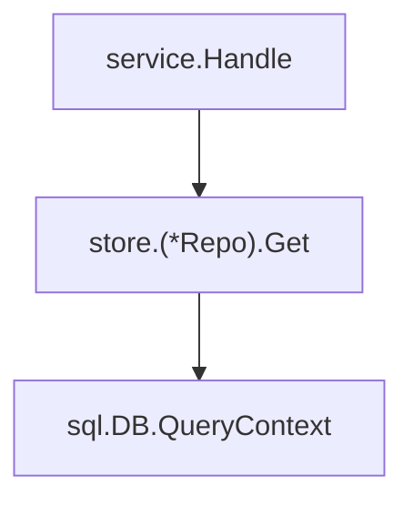

# Go Callgraph

Use this skill when the user needs to understand the call relationships of a Go
package, function, or method. Produce a Mermaid diagram as the main result.

## Helper

Use [scripts/callgraph.go](scripts/callgraph.go) for a deterministic CHA graph
when a reusable command is useful. Run it in the Go module to analyse; that
module must already depend on `golang.org/x/tools`:

```sh
go -C /path/to/module run /path/to/go-callgraph/scripts/callgraph.go \
  -package ./internal/service \
  -target '(*example.com/project/internal/service.Store).Create' \
  -direction callers \
  -depth 4
```

The helper accepts a Go package pattern with `-package`, an exact SSA function
name with `-target`, and `callers`, `callees`, or `both` with `-direction`.
Use `-dir` only when the package-loading directory differs from the module
where `go run` executes. Use `-list` to print available SSA function names
before selecting a target. Its output is a sorted list of caller-to-callee
edges; convert those edges to the requested Mermaid diagram. The helper uses
CHA, so use direct analysis code instead when RTA or VTA is needed.

## Analysis

- Work from the selected Go module. Use `go/packages` to load the requested
  package and its dependencies, then construct SSA with `ssautil.AllPackages`.
- Construct the graph with an analysis in `golang.org/x/tools/go/callgraph`,
  such as `cha.CallGraph`, `rta.Analyze`, or `vta.CallGraph`. State which
  analysis was selected. The helper script uses CHA.
- Select the narrowest analysis that answers the question. Use static analysis
  only when interface dispatch does not matter. Use CHA for a fast package-wide
  view. Use RTA or VTA when entry points and dynamic dispatch materially affect
  the result.
- Use `Node.In` to find callers and `Node.Out` to find callees. Deduplicate
  edges for the diagram because a Go call graph can contain more than one edge
  for the same caller and callee. Treat a reported edge as a possible call, not
  proof that the call occurs at run time.
- Match methods by package path, receiver, and method name. If this is not
  unique, report the ambiguous matches and ask the user to select one.

## Diagram scope

- For a named function or method, include the target, all reachable callers up
  to a useful depth, and direct callees when they explain the path. Prefer a
  caller-only diagram if the user asks only "who calls this?".
- For a package request, include package-local functions and boundary calls to
  other packages. Collapse standard-library, generated, synthetic, and large
  external subgraphs unless they are central to the requested path.
- Exclude the synthetic root by default. Keep `main` and package initializers
  when they explain an entry path.
- Mark recursion explicitly. Stop expansion at a stated depth when the graph
  would become difficult to read.

## Mermaid output

Return one fenced `mermaid` flowchart. Make caller-to-callee edges point in the
same direction as the Go call graph. Use stable node IDs and readable labels:



Use subgraphs only when package boundaries improve readability. Add a short
note after the diagram that states the analysis method, selected scope, depth
limit, and important limits such as unresolved dynamic calls or excluded code.

## Verification

Confirm that each displayed function or method maps to an SSA function in the
loaded module. If the graph is incomplete because package loading, build tags,
or type errors prevent analysis, state the exact limitation and provide the
partial diagram only when it remains useful.

See the [callgraph package documentation](https://pkg.go.dev/golang.org/x/tools/go/callgraph)
for graph semantics. Its edges represent possible calls and its graph has a
synthetic root node.
