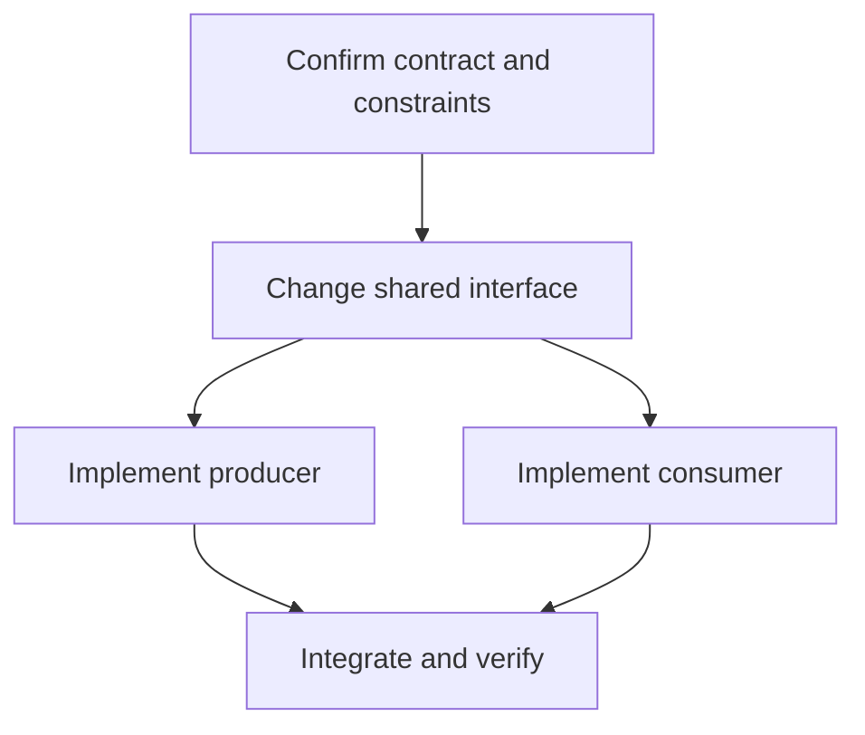

# Graph This Out

Build an evidence-based implementation DAG before making substantive changes. Trace the actual system deeply enough that nodes describe concrete work, not generic planning phases.

## Explore Depth First

1. Establish the requested outcome, acceptance criteria, constraints, and explicit exclusions.
2. Read applicable repository instructions and inspect the working tree without disturbing unrelated changes.
3. Find the primary entry point for the requested behavior.
4. Follow that path depth first through callers, callees, data flow, configuration, persistence, interfaces, and tests. Prefer primary source files over filenames or architectural guesses.
5. Continue into adjacent branches only when they can change the implementation order, public contract, risk, or verification strategy.
6. Record the discovered change surface, existing patterns to preserve, unknowns, and likely validation commands.
7. Stop when there is enough evidence to order the work confidently. State material uncertainty instead of inventing detail.

Do not edit production files during this exploration unless the user explicitly asks for immediate implementation and the edit is necessary to continue discovery.

## Construct the DAG

Translate the exploration into a directed acyclic graph:

- Make each node a concrete work item, decision gate, integration point, or verification step.
- Label nodes with the affected component or file when known.
- Draw `A --> B` only when B genuinely depends on A.
- Split independent work into separate branches and merge them at the earliest real integration or verification point.
- Include testing, migration, documentation, rollout, or cleanup nodes only when the task requires them.
- Put unresolved decisions before the work they block.
- Keep the graph acyclic. Never use an edge to show feedback or repetition; describe iteration outside the graph.
- Keep the diagram legible. For a large task, group related nodes in Mermaid subgraphs and omit incidental file-by-file chores.

Print a valid Mermaid diagram before substantive implementation. Prefer this form:

## Identify Agent Lanes

After the diagram, identify concrete opportunities for parallel agents. For each useful lane, state:

- the DAG nodes it owns;
- the prerequisite that makes it ready;
- the files or subsystem it may touch;
- the merge or handoff point;
- any shared-file or contract collision risk.

Recommend parallel agents only for independent, bounded work that can produce a reviewable result. Keep tightly coupled work on the critical path with one owner. Do not claim parallelism when tasks merely appear next to each other but depend on the same unresolved interface.

Do not spawn agents solely to create the graph. If implementation continues, delegate only when the active collaboration instructions permit it and the agent lane is ready.

## Present the Result

Present, in order:

1. A concise lay-of-the-land summary citing the discovered entry points, dependencies, constraints, and test surface.
2. The Mermaid DAG.
3. The critical path and any decision gates or assumptions.
4. The proposed agent lanes, or explicitly state that no safe parallelization was found.

If the task includes implementation, convert the DAG into the working plan and proceed in dependency order. Update the DAG or plan when discovery invalidates an earlier assumption; do not preserve a graph that no longer matches the system.
